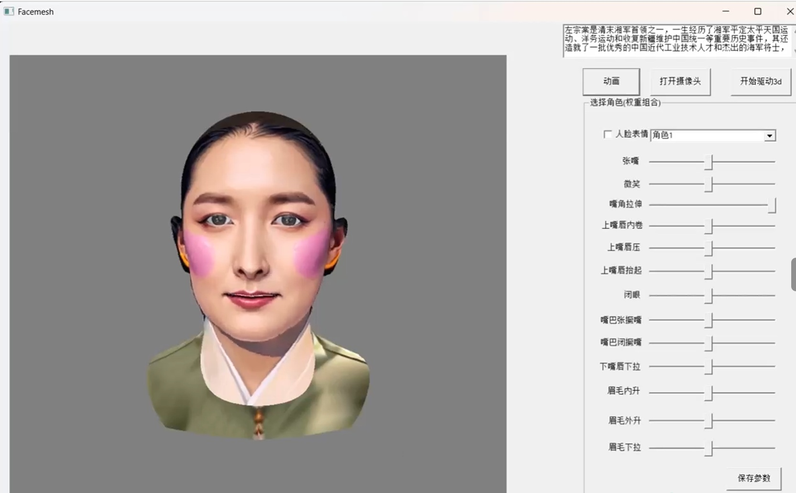

此是源码 用 vs2015 release x64 可以 直接 编译，若编译不了,请留言

因为项目涉及TTS模型110M，语音对齐模型50M；还有3d模型60M，整体项目压缩280左右，发布包120M左右非常适合端侧；

如果tts模型再减半整体发布包会更小

1 本项目实现 tts 驱动3d人脸

2 本项目也实现普通的usb摄像头，捕获人脸表情然后驱动3d人脸

效果如下

 https://bilibili.com/video/BV1a6rfBsEL2/
 
 
 

源码来自

1 核心的3d人脸模型以及线性变化关键算法来自  https://github.com/USC-ICT/ICT-FaceKit

2 用tts驱动3d人脸的时，做了语音对齐算法 来自 https://github.com/open-speech/speech-aligner/

3 opengl参考 nehe的代码 

4 获取人脸的52维表情系数 代码来自  https://github.com/philgatt/Blender-Face-Motion-Capture-AR-Kit

5 tts的代码来自 https://github.com/k2-fsa/sherpa-onnx

